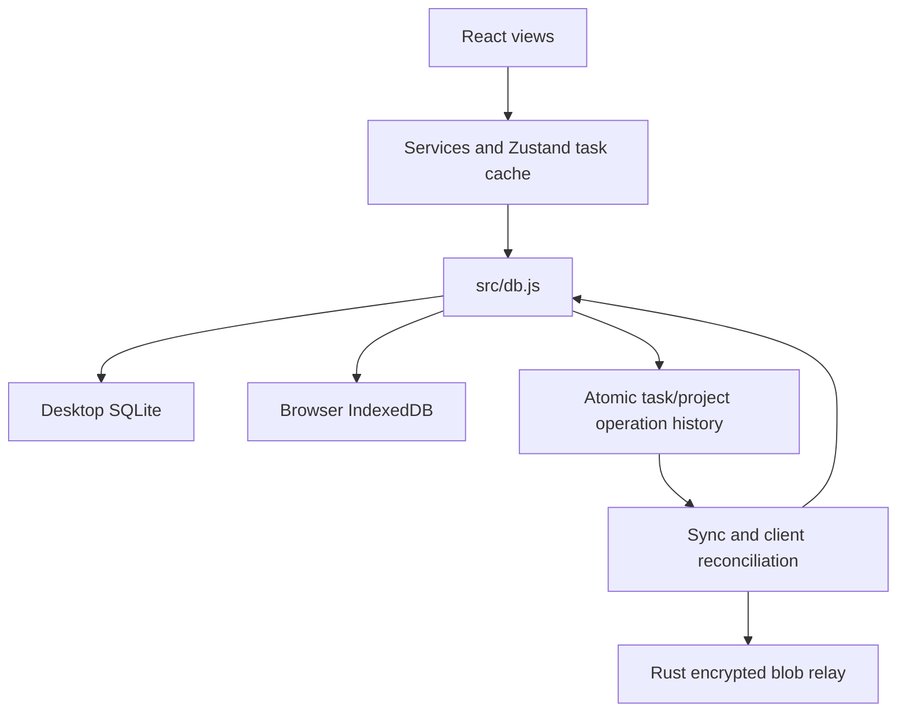

# Architecture & Tech Stack

Cognate 3.0.3 is a React/Vite planner with a Tauri desktop shell and a browser/PWA build. It is under production stabilization; see [PRODUCTION_ROADMAP.md](PRODUCTION_ROADMAP.md) for audited gaps and acceptance criteria.

| Layer | Implementation |
|---|---|
| UI | React 19, Zustand 5, Chart.js, Vite 7 |
| Desktop | Tauri 2, Rust commands, SQL/notification/shell/OAuth/updater plugins |
| Local data | SQLite on desktop; versioned transactional IndexedDB workspace in browser |
| Planner | Rust `planner.rs` on desktop; TypeScript solver in `planService.ts` in browser |
| Sync | TypeScript operation log and projection; separate Rust ciphertext relay |
| Crypto | WebCrypto PBKDF2/AES-GCM; ECDSA P-256 for shared operations |

## Current data flow

1. Components call services; Zustand caches tasks and UI state.
2. `taskService` uses `src/db.js`. Native task/project commands commit rows and full-field operations together in SQLite; the browser commits both in one IndexedDB transaction. Task mutation failures revert optimistic UI and surface an error.
3. Undo, recurrence, reorder, focus counts, task/project deletion, and schedule writes use that command path. Plans commit schedules, history and explanations atomically with task/calendar/work-hour preconditions. Calendar refresh replaces one source transactionally.
4. Sync uploads signed, sealed, immutable batches with durable acknowledgements and saved cursors. Import/pull validates structural collisions, blocks reconciliation of unlogged local gaps, and commits the merged projection with admitted operations together. The operation log is not yet the sole read source.
5. Shared-project clients additionally verify signatures and roles before ingesting operations.

The operational task store remains SQLite/IndexedDB. Historical row/history gaps can still exist and **must be audited before authoritative replay**. `projector.ts` computes a projection and diff; appends of collaboration metadata do not automatically rewrite task rows. Atomic task/project commands, guarded projection commits and explicit discrepancy audit/repair are implemented; incremental transport and identity recovery have local tests; installed/staging validation and journal compaction remain open.

## Planning and platform boundaries

Both planners greedily place tasks around busy intervals and pinned blocks. Reasons are heuristic labels. A shared adversarial corpus verifies input bounds and pin conflicts in both engines. Tests cover timezone/DST conversion, midnight clipping and atomic/stale-plan protection; broader property/installed-runtime fixtures remain open. Auto-plan initiates planning; opening the app does not guarantee a refreshed valid day plan.

Storage, planning, secret storage, HTTP transport, notifications, backups, and updates differ across platforms. Browser tests exercise IndexedDB and the TypeScript planner, not native SQLite or installed OS integrations.

## Sync and privacy limits

Personal sync encrypts ECDSA-signed incremental batches with a versioned passphrase-derived AES-GCM key. Shared batches bind signatures to a share/epoch and enforce client-side entity scope and roles; owner-signed invitations and read-key rotation distribute new epochs. The relay stores encrypted blobs and does not inspect their plaintext or enforce project membership.

The relay sees room/actor identifiers, size, timing, and network metadata. Encryption does not guarantee availability, freshness, durable acknowledgement, or revoke a former member's retained read key. Project/task and share namespace admission is now checked. Signed share-context binding and read-key rotation remain outstanding. Desktop keychain failures return errors without plaintext fallback; browser secrets remain unencrypted workspace values in IndexedDB.

## Data safety and verification

Startup preserves tasks with matching content. Settings → Housekeeping provides a read-only suspected-duplicate report; users can review and move individual tasks to Trash through the normal UI.

Desktop backup/restore uses SQLite online backup with integrity/schema checks, published snapshots, and a required pre-restore safety snapshot. The adapter drains operations and closes its pool before transactional restoration. Real SQLite WAL/failure fixtures pass; installed platforms and interrupted-process recovery still need validation.

CI checks TypeScript, web build/artifact verification, Vitest, Chromium E2E, Rust tests, and Clippy on both crates. Rust formatting is currently advisory. Test coverage and its limits are described in [TESTING.md](TESTING.md). There is no reproducible performance baseline; see [BENCHMARKS.md](BENCHMARKS.md).
