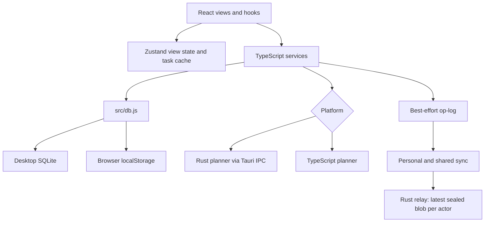

## What I found in the repository

The audited checkout is commit `d04dac5eb1472e34c22800b2dd315576aba6e7cc`, version 3.0.3. It contains a React/Vite application, a Tauri desktop crate, six SQLite migrations, and a separate Rust relay crate.

Task writes currently go to SQLite or browser `localStorage` first. Recording them in the op-log is best effort; the op-log is not yet the authoritative data store.

The Rust and TypeScript day planners both exist. Desktop invokes Rust; the browser runs TypeScript. The first-run flow can plan a day, while subsequent planning is primarily initiated through **Auto-plan**.

The relay stores encrypted blobs, one latest blob per room and actor. Shared-project operations are signed and checked by clients; personal workspace operations are not signed.

I ran the available checks: **206 Vitest tests, 17 Chromium E2E tests, 13 desktop Rust tests, 10 relay Rust tests, TypeScript, the web build, build verification, and Clippy on both crates passed**. These checks do not establish native runtime behavior, production sync safety, or recovery reliability.

# Cognate Production Roadmap

## 1. Executive Summary

Cognate is a working planner prototype with substantial product surface: task capture, several views, a deterministic day solver, local persistence, encrypted relay transport, shared-project roles, AI helpers, and desktop packaging code. Its strongest production risk is **data integrity**. The application describes the op-log as its source of truth, but ordinary writes, planning changes, undo, recurrence, and project operations do not consistently enter it. Sync reconciliation can then write an incomplete projection back over local data.

The production path should first protect existing data, establish one durable mutation path, and make planning trustworthy under real calendar and time conditions. Sync, security, browser storage, recovery, native polish, and release automation follow those foundations. The product promise to optimize is: **open Cognate and receive a plan that is current, explainable, and safe to change**.

## 2. Repository Reality Check

The repository has `src/components`, `src/hooks`, `src/services`, [`src/db.js`](../src/db.js), six [desktop migrations](../src-tauri/migrations/001_init.sql), [`server/src/main.rs`](../server/src/main.rs), 33 frontend test files, six Playwright spec files, and three GitHub workflows. The browser build produces `dist/`; `site/` is a separate static site. There is no root Cargo workspace, native mobile project, or web application deployment workflow.

Several documents describe a later architecture as if it were current. For example, [ARCHITECTURE.md](ARCHITECTURE.md) says operations are appended and projected on every mutation, while [`taskService.addTask`](../src/services/taskService.ts) writes the database first and starts op-log recording without awaiting it. [PROJECT_STRUCTURE.md](PROJECT_STRUCTURE.md) lists files that are absent. [BENCHMARKS.md](BENCHMARKS.md) gives precise latency and load figures without a benchmark harness in this checkout. [CONTRIBUTING.md](../CONTRIBUTING.md) links to a missing `plan.md`.

The canonical workflow currently traces as follows: [`quickAddService.quickAdd`](../src/services/quickAddService.ts) parses and creates a task; [`taskService`](../src/services/taskService.ts) stores it; [`planService.planDay`](../src/services/planService.ts) reads Zustand tasks and calendar rows, invokes Rust or TypeScript, then writes blocks individually; [`PlanView`](../src/components/PlanView.tsx) displays them. Optional sync later uploads a sealed copy of the op-log. The weak links are incomplete logging, non-atomic planning writes, stale calendar data, and reconciliation.

## 3. Current Architecture

SQLite is presently an operational store, not merely a projection. [`projector.ts`](../src/services/projector.ts) is a pure projection and diff module; it does not run on every append. [`syncService.reconcileIntoApp`](../src/services/syncService.ts) runs reconciliation during import or pull.

The six migrations define `tasks`, `app_state`, `projects`, `milestones`, `templates`, `calendar_events`, and `oplog`. Primary keys are text IDs except `app_state.key` and `oplog.id`. Indexes exist for `tasks.deleted_at`, `calendar_events.start`, and op-log order/entity. Task project, parent, and milestone IDs have **no foreign keys**; scheduling values have no range checks. Calendar events, settings, templates, and much project state sit outside the personal op-log. Migration order is registered in [`src-tauri/src/lib.rs`](../src-tauri/src/lib.rs); browser storage has no comparable versioned migration system.

## 4. Feature Verification Matrix

Statuses describe implementation in this checkout. “Tested” means the cited tests exercise a relevant path, not that the feature is production ready.

| Feature | Actual status | Evidence | Tests | Problems and confidence |
|---|---|---|---|---|
| Task capture and CRUD | **Implemented** | [`taskService`](../src/services/taskService.ts), [`TaskModal`](../src/components/Modals/TaskModal.tsx) | [Task-flow E2E](../e2e/task-flow.spec.ts) | DB-first writes; modal reports success after `editTask` can swallow failure. High confidence. |
| Natural-language quick add | **Implemented, partial language coverage** | [`nlQuickAdd.parseQuickAdd`](../src/services/nlQuickAdd.ts), [`quickAdd`](../src/services/quickAddService.ts) | Parser and service tests | Explicit times pin directly without collision validation. High. |
| Day planning | **Implemented, partially integrated** | [Rust planner](../src-tauri/src/planner.rs), [`planDay`](../src/services/planService.ts) | Rust, Vitest, [plan E2E](../e2e/plan.spec.ts) | No atomic plan commit, limited time model. High. |
| Automatic reflow | **Partially implemented** | [`useAutoReflow`](../src/hooks/useAutoReflow.ts), `detectDisruption` | Unit tests for detector | Five-minute polling; errors hidden; repeated reflow can race edits. High. |
| Energy-aware planning | **Implemented heuristic, unverified learning quality** | [`energyModel.learnEnergyCurve`](../src/services/energyModel.ts) | Unit tests | Completion hour and Pomodoro total stand in for actual focus timing. High. |
| Task dependencies and recurring scheduling | **Partial** | `parent_id` and [`spawnRecurrence`](../src/services/taskService.ts) | Small recurrence tests | Parent is hierarchy, not a dependency graph; spawned task bypasses logging. High. |
| Board/List/Table/Calendar/Timeline | **Implemented** | [`App.tsx`](../src/App.tsx), component files | Browser smoke and task flow | Multiple views share one filtered task cache; mobile and a11y depth limited. High. |
| Personal op-log/CRDT | **Partially implemented; invariant broken for malformed collisions** | [`oplog.ts`](../src/services/oplog.ts), [`oplogStore.ts`](../src/services/oplogStore.ts) | Pure merge tests | Best-effort writes and ID collisions. Reproduced different results by arrival order. High. |
| Encrypted personal sync | **Partially implemented** | [`relayService.syncNow`](../src/services/relayService.ts), [`crypto.ts`](../src/services/crypto.ts) | Mock relay integration tests | Whole-log upload; unsigned operations; no confirmed durable acknowledgement. High. |
| Shared projects and roles | **Partially implemented** | [`shareService`](../src/services/shareService.ts), [`collab.applyAccessControl`](../src/services/collab.ts) | Signing/RBAC tests, mock share tests | Client admission lacks strict share-entity scope; no read-key rotation on revoke. High. |
| Comments, presence, team plan | **Partially implemented** | [`TaskComments`](../src/components/TaskComments.tsx), [`presenceService`](../src/services/presenceService.ts), [`teamPlanService`](../src/services/teamPlanService.ts) | Unit and mock transport tests | Presence is heartbeat only; teammates’ busy calendars default empty. High. |
| Google/Outlook free/busy | **Partial; live handshake unverified** | [`oauthCalendarService`](../src/services/oauthCalendarService.ts), [`CalendarAccount`](../src/components/Settings/CalendarAccount.tsx) | Mapper and URL tests | Code pasted manually; generated OAuth `state` is not checked at completion; refresh is user initiated. High. |
| iCalendar import | **Partial** | [`calendarSyncService.parseIcsBusy`](../src/services/calendarSyncService.ts) | Parser and browser E2E | No recurrence expansion or proper `TZID`; overnight events are omitted. High. |
| AI providers/Ollama | **Partially implemented** | [`ai.rs`](../src-tauri/src/ai.rs), [`aiService.ts`](../src/services/aiService.ts) | JSON parser tests | No live provider contract tests, explicit timeouts, or trustworthy “private” URL validation. High. |
| Desktop backup/restore | **Partial; restore unverified** | [`backup.rs`](../src-tauri/src/backup.rs), [`backupService.ts`](../src/services/backupService.ts) | Mock IPC tests | Plain file copies; checkpoint error swallowed; open connection on restore. High. |
| Recovery kit | **Partial** | [`recoveryService.ts`](../src/services/recoveryService.ts) | Encryption round-trip test | Restores relay/share secrets, not database or owner signing identity. High. |
| Notifications/tray/update | **Partial, platform runtime unverified** | [`notify.ts`](../src/utils/notify.ts), [`lib.rs`](../src-tauri/src/lib.rs), [`updateService.ts`](../src/services/updateService.ts) | No installed-app test | Tray exists; updater code and config exist; OS integration untested. High. |
| PWA/offline shell | **Partially implemented** | [manifest](../public/manifest.webmanifest), [`sw.js`](../public/sw.js) | Registration decision unit test | Initial shell cache omits build assets; no offline install/update E2E. High. |

## 5. Critical Reliability Problems

1. **Automatic deletion can remove legitimate work.** [`initDb`](../src/db.js) calls `dedupeTasks` on launch. Its key groups tasks by title, description, deadline, parent, and recurrence, so two intentionally identical tasks can be deleted. It does not log tombstones.
2. **A successful DB write can be absent from sync.** [`oplogStore.logTaskUpsert`](../src/services/oplogStore.ts) catches errors, while callers often use `void`. `appendOps` writes one SQLite row at a time without a transaction.
3. **Reconciliation can overwrite newer local state.** [`reconcileIntoApp`](../src/services/syncService.ts) applies the op-log projection to task rows even though planner, undo, recurrence, and reorder paths can bypass the log. Upserts and deletes are individual writes.
4. **The same operations need not converge if IDs collide.** `opId` excludes the value. `merge` keeps the first operation for a duplicate ID, and `materialize` keeps the first equal-HLC field write. I ran a direct collision case: arrival order `A,B` produced `title: one`; `B,A` produced `title: two`.
5. **Planning can leave a partial day.** [`planDay`](../src/services/planService.ts) clears schedules, then writes blocks one by one. A failure or simultaneous edit can leave a half-applied or stale plan.
6. **Backups are not proven coherent.** [`checkpoint`](../src/db.js) swallows failure; Rust then copies the live database file. Restore replaces a file while the SQL plugin may still hold an open connection.
7. **Calendar refresh can lose valid busy data.** [`syncFreeBusy`](../src/services/oauthCalendarService.ts) and [`persistBusy`](../src/services/calendarSyncService.ts) delete the old source before inserting replacements, without a transaction.
8. **The relay acknowledges writes before verified durability.** [`persist`](../server/src/main.rs) ignores write and rename failures; each successful PUT rewrites the whole in-memory store to one JSON file.

## 6. Critical Security Problems

The exact current trust model is narrower than “E2E encrypted sync.” Personal sync seals the whole op-log with AES-GCM using a key from PBKDF2 with 150,000 iterations and a fixed application salt. A 96-bit random nonce is generated per blob; AES-GCM checks ciphertext integrity on decrypt. The relay sees room ID, actor path, ciphertext size, timing, and client network metadata. Personal operations carry no signature, so anyone with that workspace passphrase can generate accepted operations. The room ID is a fast SHA-256 derivative of the passphrase, enabling offline guessing of weak passphrases.

Shared projects use a random 256-bit share secret and ECDSA P-256 signatures. [`collab.authorize`](../src/services/collab.ts) checks signer and role on the **client**, not the relay. It does not receive the permitted project ID or share namespace as an authorization input. A malicious authorized editor can therefore submit a signed operation targeting an entity outside the intended shared project and have a peer ingest it. Removing a member stops later authorized writes in the client policy but does not rotate the share secret, so the removed member retains read access to future blobs under that key. The relay can also withhold, replace, or replay blobs; signatures do not provide availability or freshness by themselves.

[`secrets.ts`](../src/utils/secrets.ts) falls back to settings when the desktop keychain fails; settings are plaintext SQLite values. In the browser, secrets use `localStorage`. The recovery kit protects exported capabilities with AES-GCM but omits the signing private key and task data. [`privateAi.isLocalProvider`](../src/services/privateAi.ts) treats an `ollama` provider as local even when a custom remote base URL is configured. The desktop CSP exists, but the web build has no CSP in [`index.html`](../index.html); broad Tauri SQL and shell permissions are listed in [`default.json`](../src-tauri/capabilities/default.json). Rust HTTP IPC commands accept caller-supplied URLs, including OAuth API calls carrying a bearer token.

## 7. Data & Sync Assessment

| Entity | Current storage and relationships | Projection/sync rule today |
|---|---|---|
| Task | `tasks.id` primary key; nullable project, parent, milestone IDs; no foreign keys | Mirrored field by field when a logging call happens; SQLite remains live write/read store. |
| Project | `projects.id`; tasks refer by text | Local DB writes; selected shared project fields become `project:` ops. Personal project history is incomplete. |
| Milestone/template | Separate tables | Local only. |
| Calendar event | `calendar_events.id`, indexed start | Local only; source refresh replaces rows. |
| Setting/secret | `app_state.key`; desktop keychain when available | No general sync; browser and fallback secrets plaintext. |
| Op | `oplog.id` primary key, HLC columns and entity index | Stored append-only, with `INSERT OR IGNORE`; no schema or signature columns. |
| Comment/member/assignee | Namespaced entities in same op-log | Projected by collaboration code after client authorization on pulls. |

A valid target invariant is: **every acknowledged command is durable as an operation and its local projection, or neither is**. Until this holds, do not treat op-log replay as a safe recovery action. Backfill needs a discrepancy report and a preserved pre-migration snapshot; “entity exists somewhere in log” is not proof its latest fields are present.

Browser `localStorage` should be replaced for production web use **after a measured migration prototype**. Its synchronous whole-array rewrites, small capacity, lack of multi-object transactions, and cross-tab overwrite risk fit a demo, not a growing op-log. IndexedDB is the initial recommendation: transactional object stores for ops, projections, metadata, and migration state with manageable implementation cost. OPFS/SQLite WASM is a later option if measured query or transaction needs justify its added runtime complexity. Neither choice guarantees permanent storage or encrypts data at rest. Browser storage is best effort unless persistence is granted, and user clearing remains possible; quota and recovery behavior must be explicit. [MDN’s storage guidance](https://developer.mozilla.org/en-US/docs/Web/API/Storage_API/Storage_quotas_and_eviction_criteria) supports this distinction.

For sync, test duplicate, replayed, missing, out-of-order, malformed, and partially transferred operations across real independent stores. A device must push newly merged history or acknowledge an incremental protocol; current [`syncNow`](../src/services/relayService.ts) pushes **before** pulling, so other devices may wait for the next cycle to receive newly merged operations. The relay is a plausible personal self-hosting prototype. Its single JSON file, unbounded body/store, fixed worker pool occupied by long polls, and optional global bearer token are insufficient for a public service. A small team service is plausible only after durability, limits, and operational tests; large-scale service needs a separately justified design.

## 8. Scheduler Assessment

The core algorithms in [`planner.rs`](../src-tauri/src/planner.rs) and [`planLocally`](../src/services/planService.ts) are structurally similar: pinned blocks reserve time, other tasks sort by deadline, priority, importance, energy, duration, and ID, then greedily take a free window. There is **no differential parity test**. Rust uses bounded integer types and lexicographic string order; TypeScript accepts broader numeric inputs and uses `localeCompare`, so behavioral identity is unproven.

| Input or event | Current behavior | Required rule |
|---|---|---|
| Past deadline | Sorted early and labeled overdue | Keep, with explicit overdue policy. |
| Zero duration | Defaults to 30 minutes in solver; effort mapping normally supplies duration | Validate a single duration contract. |
| Very long task/no free window | Reported unscheduled | Offer split/defer choices and clear capacity explanation. |
| Overlapping meetings | Merged for free-window calculation | Preserve source details and validate imported intervals. |
| Conflicting pinned tasks or pinned meeting | Both pinned blocks are emitted, even if they overlap | Flag conflict; never present an impossible plan as valid. |
| Pin outside work window or beyond midnight | Emitted without bounds check | Reject or ask for an explicit exception. |
| Task dependencies | No dependency constraint | Model only if product needs it; `parent_id` does not suffice. |
| Recurrence | Next task spawned after completion, outside planner transaction | Idempotent recurrence identity and calendar-aware date rules. |
| Timezone/DST change | Wall-clock strings and minutes-from-midnight | Store timezone/instant semantics; test skipped and repeated local times. |
| Overnight calendar event | Filtered or ignored by same-day/end-greater-than-start logic | Split into each affected planning day. |
| Edit during replan | No revision check | Commit only against the task/calendar snapshot solved. |

Reasons are simple labels such as “high priority” or “best available slot.” Persisting a plan version, constraint snapshot, unscheduled reasons, and user-visible change summary will make the result explainable after a restart. Energy learning is a heuristic based on completed tasks’ scheduled hour and Pomodoro count; it does not establish when focus actually occurred.

## 9. UI/UX Assessment

The UI has a real foundation: [`PlanView`](../src/components/PlanView.tsx), Board/List/Table/Calendar/Timeline, [`CommandPalette`](../src/components/CommandPalette.tsx), task editor, focus mode, Pomodoro, settings, shared-project panels, onboarding, empty states, and toasts. The Plan view clearly separates scheduled blocks and backlog. However, it relies on `window.prompt` for busy time and calendar input, keeps rationale only in component state, and offers drag as the main rescheduling interaction. The task editor lacks a clear error return from `editTask`; it can close after a failed persistence attempt. The current E2E accessibility tests cover two keyboard cases, not a full screen-reader or touch pass.

Use this final navigation relationship: **Today** is the plan and execution home; **Inbox** is uncategorized capture; **Tasks** owns List/Table/Board as view choices; **Projects** groups tasks; **Calendar** shows external busy time and scheduled work; **Focus** is contextual to the selected block; **Insights** and **Team** are secondary destinations; **Settings** is utility navigation. Timeline is a view of Today or Calendar, not another top-level destination. This follows capture → understand → plan → work → adapt → review while reducing the current overlap between Plan, Today, Dashboard, and Tasks.

Production polish means a task created anywhere appears immediately, failures preserve the user’s input, a plan remains understandable after restart, keyboard and touch can perform the same core actions, and sync/calendar status tells the user how current the plan is.

## 10. Cross-Platform Assessment

Tauri’s [configuration](../src-tauri/tauri.conf.json) defines a desktop window with a 900×600 minimum, custom decorations, tray code, notifications, updater endpoint, and all bundle targets. The release workflow builds on one Windows, one macOS, and one Linux runner. There is no explicit macOS Intel/Apple Silicon matrix, installed-app smoke test, Windows signing, or macOS notarization in the workflow. [SIGNING.md](../SIGNING.md) describes updater signing and says OS signing is unconfigured; actual published artifact signatures and update behavior were not verified in this audit.

For Windows, validate NSIS installation, WebView2 startup, SmartScreen/code signing, tray, notifications, relaunch, and update recovery. For macOS, add signing/notarization, Dock/menu behavior, Keychain failure handling, notifications, both architectures, and upgrade testing. For Linux, test AppImage and deb startup, Secret Service availability, tray variation, notifications, and Wayland/X11. Deep links, file associations, startup behavior, and OS-native calendar access are not implemented.

The PWA is a reasonable **mobile companion strategy** once storage, offline shell, and touch workflows are reliable. The current worker caches `/`, `index.html`, and the manifest on install, but does not guarantee first-load hashed JS/CSS assets are cached before an offline relaunch. It has no background sync or push handling. Browser background execution is subject to browser limits; [MDN documents those constraints](https://developer.mozilla.org/en-US/docs/Web/Progressive_web_apps/Guides/Offline_and_background_operation). iOS Home Screen web apps can support Web Push on supported versions, but Cognate has not implemented that server and service-worker flow; [Apple’s documentation](https://developer.apple.com/documentation/usernotifications/sending-web-push-notifications-in-web-apps-and-browsers) describes the requirement. Tauri 2 supports Android and iOS in general, but this repository contains no mobile project or mobile validation; [Tauri’s platform documentation](https://v2.tauri.app/) establishes framework capability, not Cognate readiness. Decide on native mobile only after measuring unmet calendar, background, notification, and UX needs.

## 11. AI Assessment

[`ai.rs`](../src-tauri/src/ai.rs) routes Anthropic directly and OpenAI-compatible calls for OpenAI, OpenRouter, Groq, xAI, Gemini, DeepSeek, Ollama, llama.cpp, and a custom endpoint. Calls are desktop only. AI can enrich quick add, generate drafts, suggest tags and priority, estimate duration/energy, and write briefs. The actual schedule is computed by Rust or TypeScript, so AI does not directly choose time blocks. It **can** change persisted planner inputs through [`enrichScheduling`](../src/services/planService.ts), and those estimates need provenance, validation, and user control.

Request clients do not set an explicit timeout. Live provider behavior, model availability, retries, rate limits, and cancellation are untested. JSON extraction is permissive and some helpers validate only part of the returned structure. “Go private” is a settings preset, not a guarantee: the provider check can say local while an overridden base URL is remote. Keep deterministic capture and planning available when AI fails, add strict local endpoint validation, and show which task fields would be sent to a cloud provider before opt-in.

## 12. Calendar Integration Assessment

The iCalendar path parses a useful subset of timed `VEVENT`s and has an E2E paste test. It ignores recurrence rules, timezone definitions, all-day busy policy, cancellations, and overnight spans. URL subscription fetch is desktop only and manually triggered.

Google and Microsoft code builds PKCE authorization URLs, stores tokens through the secret layer, refreshes tokens, and imports seven days of free/busy. The UI asks users to paste a code. [`completeConnect`](../src/services/oauthCalendarService.ts) does not compare the stored OAuth `state` to a callback state; no complete provider handshake is exercised by tests. A separate [`start_oauth`](../src-tauri/src/integrations.rs) command is explicitly a mock-style implementation and is not the working UI flow. Calendar refresh, expiry status, source identity, recurrence, pagination, and deletion need real-account validation. Until then, the planner should show when busy data was last refreshed and distinguish “no meetings” from “calendar unavailable.”

## 13. Testing Assessment

| System | Unit | Integration | Property | E2E | Cross-platform |
|---|---|---|---|---|---|
| Planner | Rust and TS examples | Browser plan flow | Handwritten invariants | Browser only | No Rust/TS differential test |
| Storage/migrations | Browser fallback tests | Limited real SQLite | None | Browser only | No upgrade matrix |
| Op-log/projection | Pure examples | Browser storage mocks | Fixed shuffles | Bundle import | No adversarial multi-device run |
| Crypto/RBAC | Round trips, forged signature cases | Mock relay | None generated | No malicious-client E2E | WebCrypto platforms untested |
| Relay | 10 route/unit tests | No live fault/load suite | None | Mock HTTP in frontend tests | One Linux runner |
| Calendar/AI | Parsers and mappers | No live provider contract | None | ICS paste only | Desktop handshake untested |
| UX/PWA | Selected units | 17 Chromium flows | N/A | No offline install/update test | No mobile browsers/native OS |

The 206 Vitest and 17 E2E cases are valuable regression coverage. Several critical tests are shallow for their production claim: backup tests mock IPC; relay client tests use a mock server; op-log properties use valid generated-by-code histories rather than malformed or colliding operations; E2E runs against browser `localStorage`, not Tauri SQLite. [`tests/calcPriority.test.js`](../tests/calcPriority.test.js) is outside the configured Vitest `src/**` include and therefore not part of `npm test`.

## 14. CI/CD Assessment

[`.github/workflows/test.yml`](../.github/workflows/test.yml) runs on pushes to main/master and pull requests. It runs npm tests, Chromium E2E, both Rust test suites, and Clippy on Ubuntu. Rust formatting is explicitly non-blocking. It omits TypeScript checking, production web build, build verification, migration tests, native OS matrix, dependency/security checks, and coverage gates.

[`release.yml`](../.github/workflows/release.yml) triggers on `v*` tags, builds the frontend, runs artifact isolation verification, and asks Tauri Action to package draft releases and updater metadata on three operating systems. It does not itself run the test workflow as a release gate, generate listed SHA-256 checksums, independently verify signatures, publish/test the PWA, or smoke-test installed bundles. The Pages workflow deploys `site/`, not the application in `dist/`.

## 15. Target Architecture

~~~mermaid
flowchart TD
    UI[React UI: Today, Inbox, Tasks, Calendar, Team] --> App[Application commands and queries]
    App --> Domain[Validated task, calendar, membership policies]
    Domain --> Solver[One planner contract: Rust desktop, tested TS web mirror]
    App --> Commit[Atomic local commit]
    Commit --> Ops[Validated op-log and durable outbox]
    Commit --> Proj[Queryable projections]
    Ops --> Store[SQLite desktop / IndexedDB web]
    Proj --> Store
    Ops --> Crypto[Workspace or share encryption and signatures]
    Crypto --> Relay[Bounded ciphertext relay]
    App --> Adapters[Calendar, AI, notifications, OS services]
~~~

One command layer should validate input, commit the operation plus projection, and return an explicit success or error result. The op-log can become authoritative after a measured, reversible migration proves replay equals the existing database on real data. Keep the Rust planner and TypeScript web path with a shared input/output contract and differential corpus; browser Rust/WASM is an option only if parity maintenance proves costly. Use platform adapters for storage, secrets, notifications, calendar transport, updates, and file operations. Keep the relay simple and ciphertext-only, with bounded, durable writes and an explicit threat model.

## 16. Development Phases

| Phase and release | Dependency-aware outcome | Tasks |
|---|---|---|
| 0 — v3.x baseline and data protection | Stop unintended deletion; make checks and claims honest; prove backups | R01–R03 |
| 1 — v3.x local data integrity | Audit existing data, make writes atomic, cover mutations, reconcile safely | R04–R07 |
| 2 — v3.x planner correctness | Validate inputs, calendar time, and atomic reflow | R11–R13 |
| 3 — v4.0 durable web storage and sync | Migrate browser data; validate operations and identity; harden personal/shared sync and relay | R08–R10, R14–R17 |
| 4 — v4.0 integrations and product loop | Complete OAuth, PWA offline behavior, Today workflow, accessibility | R18–R21 |
| 5 — v4.0 native and release readiness | Platform polish, diagnostics, reproducible tests, signed releases | R24–R27 |
| 6 — v4.x measured additions | Team workflow and AI privacy/quality improvements | R22–R23 |
| 7 — v5+ decision | Pilot native mobile only against proven PWA gaps | R28 |

Security, recovery, and observability are gates within these phases, not work postponed until the end.

## 17. Detailed Task Breakdown

Effort is XS/S/M/L/XL. Risk is implementation or migration risk. Each done condition is a reviewable acceptance test.

### R01 — Stop automatic task deletion

- **Priority / effort / risk:** P0 / S / Low.
- **Why:** Startup deduplication can erase intentionally identical tasks.
- **Current implementation:** initDb calls dedupeTasks in [src/db.js](../src/db.js).
- **Required change:** Disable automatic content-based deletion; report suspected duplicates by ID and origin.
- **Files/modules:** src/db.js, deduplication tests.
- **Dependencies:** None.
- **Definition of done:** Boot never deletes a user task; a fixture with intentionally identical tasks remains intact.

### R02 — Establish an enforced baseline

- **Priority / effort / risk:** P0 / S / Low.
- **Why:** Documentation and CI overstate the guarantees currently checked.
- **Current implementation:** Local checks pass, but CI omits typecheck and build gates.
- **Required change:** Add typecheck, production build, and build verification gates; correct README, architecture, testing, and benchmark claims.
- **Files/modules:** .github/workflows/test.yml, README.md, docs/.
- **Dependencies:** None.
- **Definition of done:** Pull requests fail on any required check and documentation matches implementation.

### R03 — Prove backup and restore

- **Priority / effort / risk:** P0 / L / High.
- **Why:** A live file copy can be inconsistent or replaced while SQLite holds a connection.
- **Current implementation:** Checkpoint errors are swallowed before a live database file is copied.
- **Required change:** Use SQLite online backup or a quiesced verified snapshot; close/reopen connections for restore and run integrity checks.
- **Files/modules:** src-tauri/src/backup.rs, src/services/backupService.ts, database adapter.
- **Dependencies:** R02.
- **Definition of done:** Crash, WAL, and migration restore fixtures preserve every row and operation.

### R04 — Audit and repair historical op-log gaps

- **Priority / effort / risk:** P0 / L / High.
- **Why:** Existing replay is incomplete, and blind cutover risks loss.
- **Current implementation:** Backfill checks whether an entity appears in the log, not whether its latest fields match.
- **Required change:** Compare every task/project field with projected history, save a pre-migration snapshot, and generate explicit repair operations with provenance.
- **Files/modules:** src/services/oplogStore.ts, src/services/projector.ts, database adapter.
- **Dependencies:** R03.
- **Definition of done:** A reversible report identifies differences, and repair yields equal state without silent deletion.

### R05 — Make commands atomic

- **Priority / effort / risk:** P0 / XL / High.
- **Why:** Database success and op-log failure currently diverge.
- **Current implementation:** taskService writes the DB and begins best-effort logging separately.
- **Required change:** Add a validated command transaction that commits the operation, projection, and outbox together, with explicit errors.
- **Files/modules:** src/services/taskService.ts, database adapter, src/services/oplogStore.ts.
- **Dependencies:** R03–R04.
- **Definition of done:** Injected failures leave both data layers committed or both unchanged.

### R06 — Cover every durable mutation

- **Priority / effort / risk:** P0 / L / High.
- **Why:** Undo, reorder, recurrence, planning, and projects bypass history.
- **Current implementation:** These paths call direct database helpers or only partly log changes.
- **Required change:** Route durable mutations through R05 and make recurrence identity idempotent.
- **Files/modules:** taskService, planService, quickAddService, history and project code.
- **Dependencies:** R05.
- **Definition of done:** Replay reconstructs all supported user actions, including recurrence and undo.

### R07 — Make projection and reconciliation safe

- **Priority / effort / risk:** P0 / L / High.
- **Why:** Incomplete replay can overwrite newer local data.
- **Current implementation:** Reconciliation performs individual upserts and deletes.
- **Required change:** Gate cutover on parity, apply validated batches transactionally with revision checks, and support rollback.
- **Files/modules:** src/services/syncService.ts, src/services/projector.ts, database adapter.
- **Dependencies:** R04–R06.
- **Definition of done:** Interrupted import and duplicate replay preserve a consistent database.

### R08 — Migrate web storage

- **Priority / effort / risk:** P1 / XL / High.
- **Why:** Whole-array localStorage writes do not scale or provide transactional safety.
- **Current implementation:** Browser fallback stores data synchronously in localStorage.
- **Required change:** Prototype and adopt a transactional IndexedDB adapter with versioned import, quota handling, and cross-tab coordination.
- **Files/modules:** src/db.js, new web storage adapter and migration tests.
- **Dependencies:** R05–R07.
- **Definition of done:** Existing browser profiles upgrade and survive interrupted migration.

### R09 — Validate operations and collisions

- **Priority / effort / risk:** P0 / M / Medium.
- **Why:** The same operation ID can carry different values and produce different final states by arrival order.
- **Current implementation:** Merge accepts the first duplicate ID.
- **Required change:** Add schema/version checks, canonical content commitment or explicit collision rejection, size bounds, and a deterministic tie policy.
- **Files/modules:** src/services/oplog.ts, append and ingest paths.
- **Dependencies:** R04.
- **Definition of done:** Permutation, collision, malformed, and replay tests converge or reject deterministically.

### R10 — Persist clock and device identity safely

- **Priority / effort / risk:** P0 / M / Medium.
- **Why:** Restart and clock rollback can undermine unique operation identities.
- **Current implementation:** Clock state is reconstructed from a max-op scan and actor ID is stored as a setting.
- **Required change:** Persist HLC state, bind actor to a stable device key, and define skew and registration rules.
- **Files/modules:** src/services/oplogStore.ts, src/services/identity.ts, migrations.
- **Dependencies:** R09.
- **Definition of done:** Restart and clock rollback cannot reuse an operation identity.

### R11 — Define planner input contracts

- **Priority / effort / risk:** P0 / M / Medium.
- **Why:** Pins and numeric extremes can produce invalid plans.
- **Current implementation:** Pinned blocks bypass collision checks.
- **Required change:** Validate duration, work window, busy intervals, pinned conflicts, importance, and energy curve on both engines.
- **Files/modules:** src-tauri/src/planner.rs, src/services/planService.ts.
- **Dependencies:** R02.
- **Definition of done:** An adversarial shared corpus returns valid blocks or explicit conflicts in Rust and TypeScript.

### R12 — Model calendar time correctly

- **Priority / effort / risk:** P0 / L / High.
- **Why:** DST, overnight events, and recurrence affect availability.
- **Current implementation:** Local wall strings and a narrow ICS parser omit or misinterpret busy intervals.
- **Required change:** Use explicit timezone/instant semantics, clip intervals by day, show source freshness, and expand recurrence under tested rules.
- **Files/modules:** planService, calendarSyncService, oauthCalendarService, calendar schema.
- **Dependencies:** R11.
- **Definition of done:** DST and midnight fixtures never double-book or omit busy time.

### R13 — Commit plans atomically and reflow safely

- **Priority / effort / risk:** P0 / L / High.
- **Why:** A failed or stale solve can leave a partial day.
- **Current implementation:** Planning clears schedules and writes blocks one by one.
- **Required change:** Add plan revision and snapshot validation, a single commit, cancellable/debounced reflow, and persisted rationale.
- **Files/modules:** planService, src/hooks/useAutoReflow.ts, PlanView.
- **Dependencies:** R05–R06, R11–R12.
- **Definition of done:** Edits during solving are retained and the plan remains all-or-nothing.

### R14 — Harden personal sync protocol

- **Priority / effort / risk:** P0 / L / High.
- **Why:** Unsigned whole-log snapshots are fragile and propagation is delayed.
- **Current implementation:** syncNow pushes then pulls sealed per-actor blobs.
- **Required change:** Add authenticated operation batches, cursors and acknowledgements, bounded retries, and convergence diagnostics.
- **Files/modules:** src/services/relayService.ts, relayTransport, syncService.
- **Dependencies:** R07, R09–R10.
- **Definition of done:** Three independent stores converge through outage, duplicate delivery, and reconnect tests.

### R15 — Scope shared authorization and revocation

- **Priority / effort / risk:** P0 / L / High.
- **Why:** Client role checks do not constrain entity scope, and revoked members retain the read key.
- **Current implementation:** authorize receives genesis but no strict project scope; existing share secret remains in use.
- **Required change:** Bind operations to share/project, validate roster history, and define key rotation and revoke epochs.
- **Files/modules:** src/services/collab.ts, shareService, crypto.
- **Dependencies:** R09–R10, R14.
- **Definition of done:** A malicious editor cannot alter another project and a removed member cannot read new-epoch data.

### R16 — Fix secrets and key lifecycle

- **Priority / effort / risk:** P0 / L / High.
- **Why:** Keychain failure can fall back to plaintext settings; recovery omits owner identity.
- **Current implementation:** secrets.ts uses settings fallback and the kit lacks the owner signing key.
- **Required change:** Fail closed or use an explicit encrypted fallback; version the KDF; support identity backup, replacement, and passphrase changes.
- **Files/modules:** src/utils/secrets.ts, src/services/crypto.ts, recoveryService, src-tauri/src/secrets.rs.
- **Dependencies:** R03, R10, R15.
- **Definition of done:** A locked keychain never silently writes plaintext, and recovery limits are tested and shown to users.

### R17 — Bound and durably acknowledge relay writes

- **Priority / effort / risk:** P1 / L / Medium.
- **Why:** Best-effort persistence and unbounded blobs threaten availability and correctness.
- **Current implementation:** One JSON snapshot is rewritten per PUT while long polls occupy workers.
- **Required change:** Add request/storage quotas, durable atomic writes with reported errors, bounded polls/concurrency, metrics, and a TLS deployment guide.
- **Files/modules:** server/src/main.rs.
- **Dependencies:** R14.
- **Definition of done:** Disk-full, oversized request, restart, and poll-load tests produce bounded, correct responses.

### R18 — Complete calendar OAuth

- **Priority / effort / risk:** P0 / L / High.
- **Why:** The live integration and token lifecycle are unverified.
- **Current implementation:** Users paste a code and generated state is not checked on completion.
- **Required change:** Add loopback callback and state validation, fixed provider endpoints, token failure handling, scheduled refresh, and atomic event replacement.
- **Files/modules:** src/services/oauthCalendarService.ts, src-tauri/src/integrations.rs, CalendarAccount.
- **Dependencies:** R12, R16.
- **Definition of done:** Live test accounts connect, refresh, revoke, and recover without token leaks.

### R19 — Make PWA offline lifecycle reliable

- **Priority / effort / risk:** P1 / M / Medium.
- **Why:** First offline launch may lack hashed application assets.
- **Current implementation:** The worker installs a shell-only cache list.
- **Required change:** Precache versioned build assets, handle update/rollback UX and storage persistence, and add offline launch tests.
- **Files/modules:** public/sw.js, src/pwa.ts, build configuration.
- **Dependencies:** R08.
- **Definition of done:** A fresh install relaunches offline, upgrades cleanly, and retains local data.

### R20 — Center the Today workflow

- **Priority / effort / risk:** P1 / L / Medium.
- **Why:** Returning users may need to plan manually and rationale disappears after restart.
- **Current implementation:** Plan/Today overlap, and reasons are transient.
- **Required change:** Show a trustworthy initial plan, freshness/conflicts, capture-to-review flow, and safe failure states.
- **Files/modules:** src/App.tsx, Sidebar, PlanView, TaskModal.
- **Dependencies:** R11–R13, R18.
- **Definition of done:** Returning users see a current, explainable day or a clear reason planning cannot complete; failed edits preserve input.

### R21 — Accessibility and touch pass

- **Priority / effort / risk:** P1 / M / Low.
- **Why:** Drag-only or dense controls limit use.
- **Current implementation:** Two narrow accessibility E2E checks exist.
- **Required change:** Add keyboard pin/reschedule, focus/order audit, touch layouts, reduced motion, and screen-reader testing.
- **Files/modules:** Components, src/style.css, E2E.
- **Dependencies:** R20.
- **Definition of done:** The core workflow works without drag, mouse, or a wide viewport.

### R22 — Complete team workflow

- **Priority / effort / risk:** P2 / L / Medium.
- **Why:** Permissions alone do not make team planning trustworthy.
- **Current implementation:** Comments and presence exist, but teammate calendars default to empty.
- **Required change:** Add invite acceptance, roster diagnostics, assignment review, and explicit capacity/unavailable-calendar states.
- **Files/modules:** SharedProjects, shareService, teamPlanService.
- **Dependencies:** R15, R17, R20.
- **Definition of done:** Owner/editor/viewer journeys and revoked-device scenarios pass.

### R23 — Validate AI advice and privacy

- **Priority / effort / risk:** P2 / M / Medium.
- **Why:** AI estimates affect plans and remote endpoints can be misclassified as private.
- **Current implementation:** Provider URL checks and output validation are partial.
- **Required change:** Verify local URLs, preview data sent to remote providers, validate output schemas, add timeouts/cancellation, and record estimate provenance.
- **Files/modules:** privateAi, aiService, src-tauri/src/ai.rs, planService.
- **Dependencies:** R16, R20.
- **Definition of done:** Offline fallback always works and a remote provider is never labeled local.

### R24 — Native desktop polish

- **Priority / effort / risk:** P1 / L / Medium.
- **Why:** A packaged webview still needs dependable OS behavior.
- **Current implementation:** Tray and updater code exist with little installed-app validation.
- **Required change:** Test window/tray lifecycle, notification actions, install/update recovery, keychain, and filesystem behavior by OS.
- **Files/modules:** Tauri lib/config, Titlebar, notify/update services.
- **Dependencies:** R03, R16, R20.
- **Definition of done:** Installed Windows/macOS/Linux smoke matrix passes.

### R25 — Diagnostics and measured performance

- **Priority / effort / risk:** P1 / M / Low.
- **Why:** Sync failures can be hidden and benchmark claims are unsupported.
- **Current implementation:** Console warnings and static benchmark numbers.
- **Required change:** Add privacy-safe diagnostics, sync health UI, reproducible task/op/relay benchmarks, and measured budgets.
- **Files/modules:** Logger, hooks, relay, benchmark harness, docs.
- **Dependencies:** R13–R17.
- **Definition of done:** 100/1k/10k tasks and 50k operations have recorded CPU, memory, and latency results.

### R26 — Expand reliability gates

- **Priority / effort / risk:** P1 / L / Medium.
- **Why:** Current suites miss real database, native, and fault paths.
- **Current implementation:** Ubuntu browser and Rust unit suites.
- **Required change:** Add migration, recovery, multi-device fault, Rust/TS parity, PWA, and OS smoke suites.
- **Files/modules:** tests/, e2e/, workflows.
- **Dependencies:** R03–R25 as features land.
- **Definition of done:** A release candidate passes the coverage matrix in section 20.

### R27 — Build a verified release pipeline

- **Priority / effort / risk:** P1 / L / High.
- **Why:** Tags can bypass test gates and artifacts lack independent verification.
- **Current implementation:** Draft Tauri build workflow.
- **Required change:** Gate version parity, explicit OS/architecture matrix, checksums, signing/notarization, updater verification, web deployment, and rollback smoke.
- **Files/modules:** .github/workflows/release.yml, SIGNING.md, scripts.
- **Dependencies:** R24, R26.
- **Definition of done:** Every published artifact installs, updates, and restores test data.

### R28 — Decide native mobile from evidence

- **Priority / effort / risk:** P3 / M / Medium.
- **Why:** PWA may be sufficient for capture, but perhaps not for background or native flows.
- **Current implementation:** No native mobile project.
- **Required change:** Run a PWA field study; pilot Tauri mobile or another client only for demonstrated unmet needs.
- **Files/modules:** Mobile pilot/config only after decision.
- **Dependencies:** R08, R19–R21, R25.
- **Definition of done:** Measured criteria justify either building or deferring native clients.

## 18. Dependency Graph

~~~mermaid
flowchart LR
    R01 --> R04
    R02 --> R03 --> R04 --> R05 --> R06 --> R07
    R04 --> R09 --> R10 --> R14 --> R15
    R07 --> R08 --> R19
    R07 --> R14 --> R17
    R02 --> R11 --> R12 --> R13 --> R20 --> R21
    R05 --> R13
    R12 --> R18 --> R20
    R10 --> R16 --> R18
    R15 --> R16
    R15 --> R22
    R20 --> R23
    R20 --> R24
    R17 --> R25 --> R26 --> R27
    R24 --> R27
    R19 --> R28
    R21 --> R28
~~~

The graph expresses hard prerequisites; independent branches can progress concurrently after the data safety baseline.

## 19. Platform Compatibility Matrix

Supported means code exists; it does not imply installed-app validation in this audit.

| Capability | Windows | macOS | Linux | Web | Android | iOS |
|---|---|---|---|---|---|---|
| Task UI and local planner | Supported, Rust | Supported, Rust | Supported, Rust | Supported, TS | PWA limited | PWA limited |
| Local durable store | SQLite | SQLite | SQLite | localStorage limited | PWA storage limited | PWA storage limited |
| Offline editing | Supported, native unverified | Supported, native unverified | Supported, native unverified | Limited by cache/storage | PWA limited | PWA limited |
| Relay sync | Supported, native unverified | Supported, native unverified | Supported, native unverified | Supported, limited | PWA limited | PWA limited |
| Shared projects | Supported, partial | Supported, partial | Supported, partial | Supported, partial | PWA limited | PWA limited |
| Google/Outlook OAuth | Partial desktop | Partial desktop | Partial desktop | Not supported | Not supported | Not supported |
| ICS text import | Supported | Supported | Supported | Supported | PWA supported | PWA supported |
| ICS URL fetch | Supported desktop | Supported desktop | Supported desktop | Not supported | Not supported | Not supported |
| AI provider calls | Supported desktop | Supported desktop | Supported desktop | Not supported | Not supported | Not supported |
| Notifications | Native code, unverified | Native code, unverified | Native code, unverified | Foreground API limited | PWA limited | PWA limited; no Cognate push |
| Tray/menu | Native tray code | Native tray code | Native tray code | N/A | N/A | N/A |
| Local backup/restore | Partial | Partial | Partial | Not supported | Not supported | Not supported |
| Signed auto-update | Configured, release unverified | Configured, release unverified | Configured, release unverified | Service worker limited | PWA lifecycle limited | PWA lifecycle limited |
| Native mobile client | N/A | N/A | N/A | N/A | Future decision | Future decision |

## 20. Testing Strategy

Use a small set of release-blocking invariants: an acknowledged write survives restart; replay matches the projection; any order of the same valid operation set yields the same state; duplicate delivery changes nothing; unauthorized operations never change state; a plan has no unreported collision; restore returns the exact pre-failure dataset.

Exercise offline-first transitions with independent stores: online; offline; offline to online; online to offline; intermittent or slow network; unavailable or restarted relay; device or browser restart; application crash; corrupt DB or op-log; partial batch; and duplicate batch. Expected behavior is local editing with explicit pending state, durable queued changes, bounded retry, no partial projection, and a visible recovery path when validation fails. Malformed data must not be silently skipped while reporting synced.

Add differential planner fixtures for Rust and TypeScript, real SQLite migration tests from each released schema, IndexedDB upgrade tests, restore tests with WAL writes, and a live relay process fault suite. Keep existing Chromium flows; add installed-app smoke tests and mobile viewport/device tests where they protect a real workflow.

## 21. Security Strategy

Prioritize the demonstrated boundaries: remove plaintext secret fallback; bind personal and shared operations to authenticated identities and document scope; reject malformed or colliding IDs; define replay and freshness checks; rotate share keys after revocation; and test recovery of owner authority. Version cryptographic envelopes and KDF parameters so upgrades are possible. A strong random share secret already exists; workspace passphrase policy and room derivation need redesign against guessing.

Restrict Rust network IPC destinations and request sizes, minimize Tauri SQL and shell capabilities, give the web build a CSP, enforce OAuth state/PKCE callback validation, store tokens only in an approved secret backend, and redact credentials from errors and logs. Add dependency and secret scanning to CI. The relay needs TLS expectations, authentication suitable to its deployment tier, per-room and per-IP limits, storage quotas, malformed-blob handling, and audit metrics. Update authenticity depends on verified updater signatures; broad distribution also needs Windows signing and macOS notarization.

## 22. Performance Strategy

Treat [docs/BENCHMARKS.md](BENCHMARKS.md) figures as unverified claims. Build a reproducible harness using fixed hardware descriptions, dataset seeds, cold and warm runs, and percentile reporting. Measure 100, 1,000, and 10,000 tasks; 50,000 operations; large shared workspaces; many members; and large sync batches. Record planner latency, op append/projection/storage latency, render interaction latency, startup, sync latency, CPU, peak memory, and relay disk write cost. Include mobile PWA cold and offline startup. Compare before and after storage and protocol changes; set budgets from measured user experience rather than the current document's numbers.

## 23. Recovery & Disaster Strategy

A desktop SQLite backup can recover local task data only if its file copy is coherent and available. The current encrypted recovery kit restores relay/share capabilities, not task data or the owner signing identity. Relay loss is recoverable from surviving devices or verified local backups; a lost sole device plus lost relay and no backup is not recoverable. A lost passphrase or share secret cannot decrypt existing ciphertext. Revoked read access cannot be retroactively withdrawn from already decrypted data.

Implement versioned encrypted export containing data plus required identity material under a separately managed recovery passphrase, with clear scope and integrity checks. Keep local scheduled backups, an optional user-controlled external export, pre-migration snapshots, and a tested restore wizard. For corruption, quarantine bad records, preserve raw files, check integrity, restore the last verified snapshot, then replay only validated later operations. Never auto-repair by deleting ambiguous tasks.

| Failure | Recoverable with | Current limit |
|---|---|---|
| Local database corruption | Verified local snapshot plus validated later operations | Backup coherence and replay completeness are unproven |
| Failed migration | Pre-migration snapshot and tested rollback path | No full upgrade/rollback matrix |
| Lost device | Surviving device or verified export with identity material | Recovery kit lacks task data and owner signing identity |
| Lost passphrase/share secret | Separately retained capability or another authorized device | Ciphertext alone cannot recover the key |
| Relay loss | Surviving local data or verified backup | Relay is not a backup |
| Revoked member | New key epoch for future ciphertext | Previously read data cannot be retracted |

## 24. Release Engineering

The required pipeline is commit → formatting/lint/typecheck → unit and property tests → real storage/integration tests → browser and native smoke tests → dependency/security checks → reproducible web and desktop builds → artifact inspection/checksums → updater signing and OS signing/notarization → draft publication → clean-install/update/restore smoke → publish. Version parity must be checked across package.json, Cargo.toml, and tauri.conf.json. Test Windows, Linux, macOS Intel, and macOS Apple Silicon explicitly before claiming all four targets. Publish the web/PWA from dist/ only after its offline and update lifecycle passes. Keep rollback instructions and a compatible data migration policy; application rollback cannot blindly downgrade a database schema.

## 25. Technical Debt Register

| Debt | Evidence | Consequence |
|---|---|---|
| Oversized mixed modules | db.js 971 lines; SettingsModal.tsx 702; taskService.ts 511; shareService.ts 474; global CSS over 4,000 lines | Hard to enforce one mutation, error, and platform policy |
| Duplicated planner logic | Rust and TS solvers | Parity can drift without shared contract tests |
| Direct DB access from UI | PlanView, settings, quick add | Bypasses command/log rules |
| Mixed source-of-truth claims | Documentation versus taskService/oplogStore | Unsafe migrations and misleading expectations |
| Silent best-effort failures | Logging, sync hooks, notifications, backup checkpoint, relay persistence | Users cannot tell whether data is safe or current |
| Platform leakage | Tauri detection and dynamic imports across services | Difficult web/native test boundaries |
| Broad settings/secret interface | Arbitrary setting and secret keys | Weak lifecycle and auditability |
| Stale documentation | Missing files, invented module layout, unsupported benchmark numbers | Contributors may implement against false assumptions |
| Missing transaction abstraction | Op append, reconciliation, plan/calendar replacement | Partial writes after failures |
| UI navigation overlap | Plan, Today, Dashboard, Tasks, and view switch | Core workflow is harder to find |

## 26. MVP vs Production vs Future

**Cognate v3.x stabilization:** R01–R07 and R09–R13. Stop automatic deletion, preserve recoverable backups, establish a truthful local data model, and make the day plan valid and atomic. Keep advanced sync/collaboration labels qualified until their guarantees are demonstrated.

**Cognate v4.0 Production:** Complete R08, R14–R21, and R24–R27. Require proven offline startup, durable browser storage, authenticated sync, scoped collaboration, calendar freshness, tested recovery, installed desktop behavior, and verified release artifacts.

**Cognate v4.x:** R22–R23, guided by actual team and AI usage. Improve collaboration and private AI after the planner and data path are dependable.

**Cognate v5+:** R28 only if PWA field evidence shows native mobile access is necessary. Avoid adding infrastructure or clients without a product requirement they solve.

## 27. First 20 Tasks

The exact implementation sequence, with files and acceptance conditions, concludes this report after the production checklist.

## 28. Definition of Done

A production task is done when its behavior is documented at the user boundary; failures return explicit states; storage and recovery invariants have fault tests; security-sensitive inputs are validated; TypeScript, build verification, Vitest, relevant Rust suites, E2E, and applicable OS smoke checks pass; and migration or rollback steps are tested on data from the previous release. A unit test that mirrors implementation is insufficient.

## 29. Final Production Checklist

- [ ] No startup path silently deletes tasks.
- [ ] Every acknowledged local mutation survives crash and replays to the same projection.
- [ ] Planner reports pin, meeting, timezone, DST, and capacity conflicts explicitly.
- [ ] Browser storage upgrade and first offline PWA launch are tested.
- [ ] Personal and shared sync converge under duplication, reordering, outages, and malicious input.
- [ ] Secret storage, key replacement, revocation, and recovery limits are tested and accurately explained.
- [ ] Calendar OAuth and recurring/overnight busy time are validated with live providers.
- [ ] Backups restore after WAL activity, failed migrations, and interrupted updates.
- [ ] Installed Windows/macOS/Linux builds pass clean-install, notification, tray, and update tests.
- [ ] Release artifacts have verified signatures, checksums, update metadata, and a rollback procedure.

The first 20 things to implement, in order:

1. **[P0] Stop automatic task deduplication.**
   - Files: src/db.js:354, deduplication tests.
   - Reason: Startup can delete intentionally identical tasks.
   - Depends on: None.
   - Done when: Boot performs no content-based deletion and reports suspected legacy duplicates without changing them.

2. **[P0] Enforce the repository baseline in CI and correct claims.**
   - Files: .github/workflows/test.yml, README.md, docs/.
   - Reason: Typecheck/build gates and architecture claims currently diverge from code.
   - Depends on: None.
   - Done when: PR checks include typecheck, build, verification, tests, and accurate status documentation.

3. **[P0] Replace unverified database file-copy recovery.**
   - Files: src-tauri/src/backup.rs, backupService, database adapter.
   - Reason: Checkpoint failures are swallowed and restore may race an open connection.
   - Depends on: 2.
   - Done when: Backup and restore preserve data through WAL writes, crash, and migration fixtures.

4. **[P0] Audit existing task rows against the op-log before cutover.**
   - Files: src/services/oplogStore.ts, projector, database adapter.
   - Reason: Current backfill checks only whether an entity ID occurs in the log.
   - Depends on: 3.
   - Done when: A reversible report identifies every missing or differing field and repairs it without silent loss.

5. **[P0] Commit task command, operation, and projection atomically.**
   - Files: src/services/taskService.ts, database adapter, oplogStore.
   - Reason: Database writes succeed while best-effort logging can fail.
   - Depends on: 3, 4.
   - Done when: Injected failures leave both data layers committed or both unchanged.

6. **[P0] Route every durable mutation through that command path.**
   - Files: taskService, planService, quickAddService, history, project services.
   - Reason: Undo, reorder, recurrence, planning, and projects bypass parts of the log.
   - Depends on: 5.
   - Done when: Replay reconstructs all supported user actions, including recurrence and undo.

7. **[P0] Make projection and import transactional.**
   - Files: src/services/syncService.ts, projector, database adapter.
   - Reason: An incomplete log can overwrite local rows during reconciliation.
   - Depends on: 4–6.
   - Done when: Parity is checked before cutover and interrupted imports leave a consistent database.

8. **[P1] Migrate browser data from localStorage to transactional storage.**
   - Files: src/db.js, new IndexedDB adapter and migration tests.
   - Reason: Whole-array rewrites, quota, and cross-tab writes threaten browser data.
   - Depends on: 5–7.
   - Done when: An existing browser profile upgrades safely, including after interruption.

9. **[P0] Validate operation schemas and reject ID collisions.**
   - Files: src/services/oplog.ts, append and ingest paths.
   - Reason: Different final states were reproduced for the same colliding operations in different orders.
   - Depends on: 4.
   - Done when: Malformed, duplicate, replayed, and colliding operations converge or are rejected deterministically.

10. **[P0] Persist HLC and bind actor identity to a device key.**
    - Files: oplogStore, src/services/identity.ts, migrations.
    - Reason: Restart and clock state currently rely on scanning stored operations.
    - Depends on: 9.
    - Done when: Restart and clock rollback cannot reuse an operation identity.

11. **[P0] Validate planner inputs and pinned conflicts.**
    - Files: src-tauri/src/planner.rs, src/services/planService.ts.
    - Reason: Conflicting or out-of-range pins can be shown as a valid plan.
    - Depends on: 2.
    - Done when: Both engines return valid blocks or explicit conflict results for adversarial inputs.

12. **[P0] Introduce a timezone-aware calendar interval model.**
    - Files: planService, calendarSyncService, oauthCalendarService, calendar migration.
    - Reason: Overnight events, DST, and timezone changes can hide busy time.
    - Depends on: 11.
    - Done when: DST and midnight fixtures occupy every affected planning interval correctly.

13. **[P0] Commit plans atomically and reject stale reflows.**
    - Files: planService, src/hooks/useAutoReflow.ts, PlanView.
    - Reason: Planning clears and rewrites blocks one by one while tasks can change.
    - Depends on: 5, 6, 11, 12.
    - Done when: A failed or stale solve leaves the prior valid plan intact.

14. **[P0] Replace personal whole-log sync with authenticated, acknowledged batches.**
    - Files: src/services/relayService.ts, syncService, relayTransport.
    - Reason: Personal operations are unsigned and push-before-pull delays propagation.
    - Depends on: 7, 9, 10.
    - Done when: Three devices converge through outages, duplicate delivery, and reconnect.

15. **[P0] Bind shared operations to their project and implement revocation epochs.**
    - Files: src/services/collab.ts, shareService, crypto.
    - Reason: Role checks lack strict entity scope and revoked members retain the read key.
    - Depends on: 9, 10, 14.
    - Done when: An authorized malicious editor cannot alter another project and a removed member cannot read new-epoch data.

16. **[P0] Remove silent plaintext secret fallback and define key recovery.**
    - Files: src/utils/secrets.ts, secrets.rs, crypto, recoveryService.
    - Reason: Keychain failure can place private keys and tokens in settings; recovery omits owner authority.
    - Depends on: 3, 10, 15.
    - Done when: Keychain failure is explicit, plaintext fallback is absent, and device replacement tests state exactly what recovers.

17. **[P1] Make relay acknowledgements durable and resources bounded.**
    - Files: server/src/main.rs.
    - Reason: Persistence errors are ignored and each PUT can rewrite an unbounded JSON store.
    - Depends on: 14.
    - Done when: Disk-full, oversized request, restart, and long-poll load tests produce bounded, correct responses.

18. **[P0] Finish and validate Google/Microsoft OAuth.**
    - Files: src/services/oauthCalendarService.ts, integrations.rs, CalendarAccount.
    - Reason: State is generated but not verified and the live handshake is untested.
    - Depends on: 12, 16.
    - Done when: Live accounts connect, refresh, revoke, and replace busy data without leaking tokens.

19. **[P1] Make first-install PWA offline startup and updates reliable.**
    - Files: public/sw.js, pwa.ts, build configuration.
    - Reason: The install cache does not guarantee required hashed assets are available offline.
    - Depends on: 8.
    - Done when: A fresh install opens offline, updates cleanly, and retains local data.

20. **[P1] Turn Today into the complete capture-to-work loop.**
    - Files: src/App.tsx, Sidebar, PlanView, TaskModal.
    - Reason: Returning users can see an empty or stale plan, rationale is transient, and edit failures can look successful.
    - Depends on: 11–13, 18.
    - Done when: Opening Cognate shows a current explainable plan or a clear reason it cannot, and failed edits preserve the user's input.
